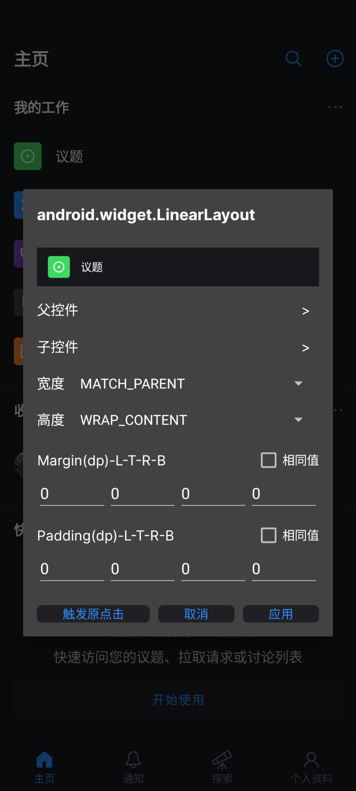
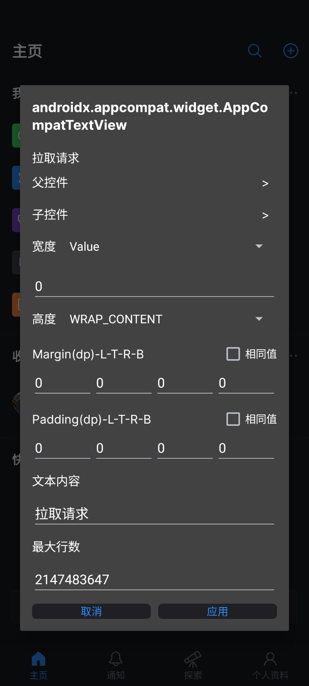
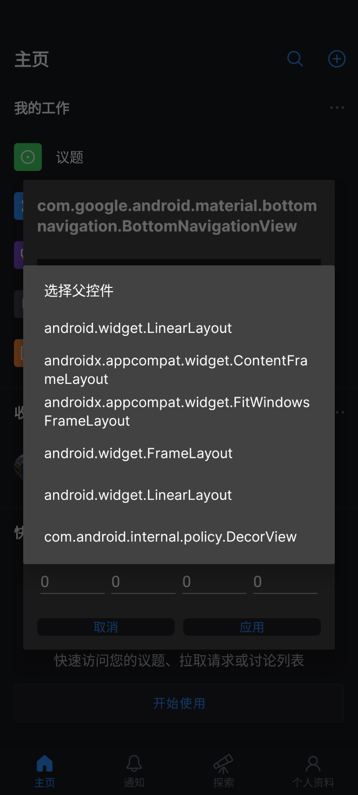
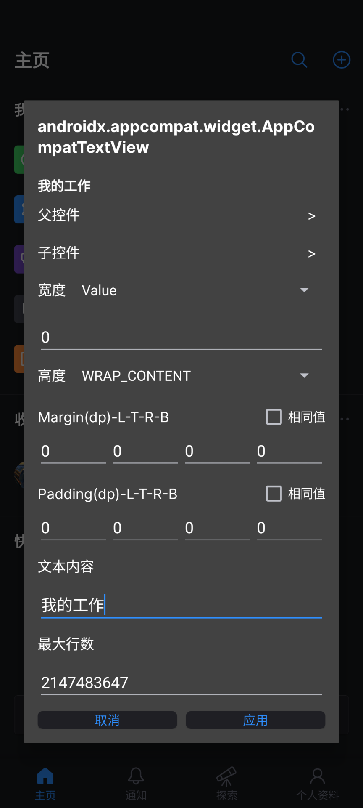

# GodViewer

一款基于 **Xposed / LSPosed** 的运行时视图调试工具：**无需重启应用**，即可在目标应用运行时修改 View 的属性，并支持 **GodMode 风格的持久化** —— 修改在应用重启后自动重放。

## 功能特性

- **触摸选择**：触摸屏幕直接选中视图，比逐个点击更高效
- **属性修改**：
  - 删除视图 / 修改可见性
  - 修改尺寸、边距（margin）、内边距（padding）
  - 修改 `TextView` 的文本内容与文本大小
  - 修改 `ImageView` 的图片（支持 URL）与缩放类型
- **属性查看器**：查看视图上所有标注 `ViewDebug.ExportedProperty` 的导出属性
- **持久化（自动重放）**：修改保存为规则，目标应用**重启 / 杀进程 / 重启手机**后自动重新生效
  - 尺寸、边距、内边距（任意 View）
  - 文本内容、最大行数（TextView）
  - 图片 URL、缩放类型（ImageView）
  - **Hide（隐藏）**：隐藏视图并持久化；从父控件的子控件列表可重新进入已隐藏视图的对话框
  - **Reset Rule（重置）**：删除规则并把视图恢复为修改前的原始状态

## 持久化设计

- 规则以 JSON 保存在**目标应用自己的数据目录**：`/data/data/<目标包名>/files/godviewer/rules.json`
- 读写都在被注入的目标进程内完成，**不注入系统服务、不需要系统级权限**，因此在 Android 16 上无兼容性风险
- 规则标识视图：`activityClass + viewClass + depth[]`（自 decorView 向下逐层 childIndex，GodMode 同款方案）
- 写入采用原子写（临时文件 + rename），异步落盘；文件损坏时按无规则处理，绝不影响目标应用运行
- 注意：目标应用**清除数据 / 卸载**后规则会丢失；升级后按资源名 / 文本 / 深度路径兜底匹配（UI 改动较大时可能匹配到相似视图）

## 构建

环境要求：

- JDK 17
- Android SDK（platform 35）
- 依赖：XposedBridge API 82（`app/libs/api-82.jar`，compileOnly）、Glide、Gson、AndroidX

```bash
./gradlew assembleDebug
```

产物：`app/build/outputs/apk/debug/app-debug.apk`

## 使用

1. 在 **LSPosed**（或其他 Xposed 框架）中勾选需要调试的目标应用，勾选后**强停**该应用
2. 打开目标应用，触摸屏幕选中视图 → 修改属性 → **Apply** 应用修改
3. 修改会自动持久化：强停并重启目标应用后自动生效
4. 点击已修改的视图 → **Reset Rule** 可删除规则并恢复原始状态

## 验证清单（Android 16 / LSPosed）

1. LSPosed 勾选目标应用并**强停**
2. 打开目标应用，点击某视图 → 修改文本或尺寸 → Apply
3. 强停并重启目标应用 → 修改自动生效
4. 再次点击该视图 → **Reset Rule** → 重启 → 恢复原状
5. 点击视图 → **Hide** → 视图隐藏；从父控件 → 子控件列表点回隐藏的视图 → **Reset Rule** 恢复

## 示例

|  |  |  |  |
| -- | -- | -- | -- |

## 项目结构

```
GodViewer/
├── app/
│   ├── libs/api-82.jar            # XposedBridge API（compileOnly）
│   └── src/main/java/com/godviewer/app/
│       ├── data/                  # 规则模型 + 存储 + 重放管理（持久化核心）
│       ├── hook/                  # Xposed hook 入口与 hookers
│       ├── handler/               # 各视图类型的属性编辑对话框
│       ├── glide/                 # 图片加载
│       └── ui/                    # 属性对话框 UI
└── docs/images/                   # 示例截图
```

## 许可

[GPL-3.0](LICENSE)
